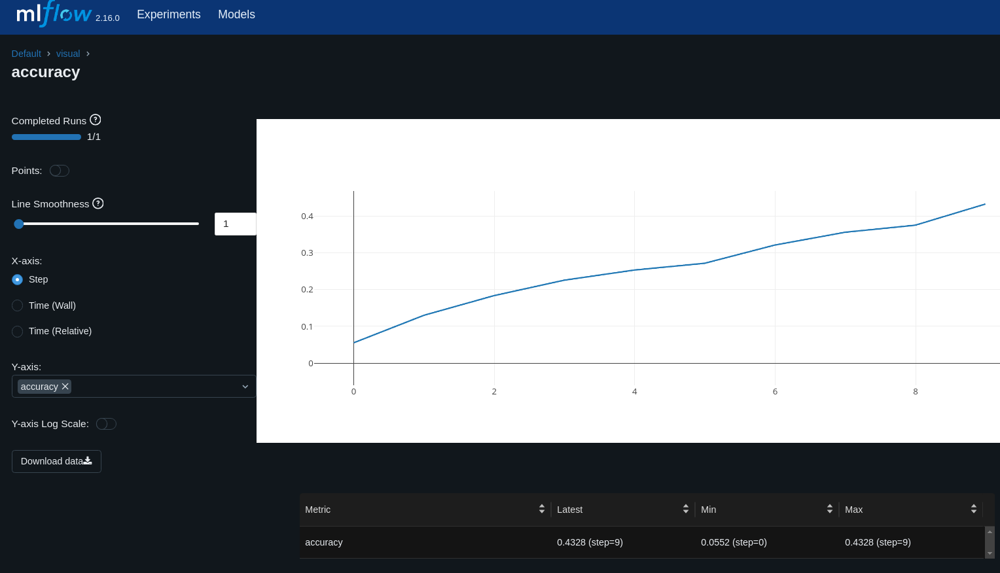

# MLflow visualization

> [!NOTE]  
> If you wish to run the included examples on LUMI, have a look at the [quickstart](../quickstart/README.md) chapter for instructions on how to set up the required environment.

[MLflow](https://www.mlflow.org/) is an open source tool for tracking experiments and models in machine learning projects. MLflow can be easily installed with `pip install mlflow`. Adapting your code to use MLflow requires minimal modification, and the results can be easily displayed using the web interface.

## Collecting logs

Enabling MLflow tracking in your Python code is simple. Some libraries support [automatic logging with MLflow](https://www.mlflow.org/docs/latest/tracking.html#automatic-logging), but even if the library you are using does not, logging can be added with just a few lines of code. For example, in our visualtransformer code we add the following lines:

```python
import mlflow

rank = int(os.environ["RANK"])
if rank == 0:
    mlflow.set_tracking_uri(os.environ['PWD'] + "/mlflow")
    mlflow.start_run(run_name=os.getenv("SLURM_JOB_ID"))
```

With `mlflow.set_tracking_uri()` we set the location where the MLflow files should be stored, replace it with the appropriate path for your own project in the example. If you don't set a location, it will create a directory called mlruns in your current working directory.

Instead of a directory, you can also use an SQLite database, just start the tracking location with `sqlite://`, for example:

`mlflow.set_tracking_uri("sqlite:////scratch/project_2001234/mlruns.db")`

Instead of setting the tracking URI in the Python code, you can also set it using an environment variable, for example in the Slurm job script:

`export MLFLOW_TRACKING_URI=/scratch/project_2001234/mlruns`

It is not mandatory to set a name for the run, but in the example above we show how to use the Slurm job id for the name.

Finally in the code where you calculate metrics that you wish to track you need to add a line to track it with MLflow. Adapting our code to include these metrics looks like so:

```python
if rank == 0:
    print(f'Epoch {epoch+1}, Loss: {running_loss/len(train_loader)}')
    mlflow.log_metric("loss", running_loss/len(train_loader), step = epoch)
...
if rank == 0:
    print(f'Accuracy: {100 * correct / total}%')
    mlflow.log_metric("accuracy", correct / total, step = epoch)

```

For a full example, have a look at the script [mlflow_ddp_visualtransformer.py](mlflow_ddp_visualtransformer.py).

In addition to metrics, you can also log parameters and artifacts. See the [MLflow documentation for a list of logging functions](https://www.mlflow.org/docs/latest/tracking.html#logging-data-to-runs).

## Visualizing the logs

To visualize and monitor your runs you can start the MLflow tracking UI using the LUMI web  interface.

To launch it, log in to the web interface at [https://www.lumi.csc.fi/](https://www.lumi.csc.fi/) and select "MLflow" from the "Apps" menu. In the submission form you need to select where the MLflow files are stored. This is the same path that you used for the `mlflow.set_tracking_uri()` method, i.e., typically:

   - a directory like `/scratch/<project>/mlruns/`, or
   - an SQLite database like `sqlite:////scratch/<project>/mlruns.db`

The default resource settings should be fine for most cases.

Once the session has started you can see graphs for loss and accuracy similar to this:


 ### Table of contents

- [Home](../README.md)
- [QuickStart](../quickstart/README.md)
- [Setting up your own environment](../setting-up-environment/README.md)
- [File formats for training data](../file-formats/README.md) 
- [Data Storage Options](../data-storage/README.md)
- [Multi-GPU and Multi-Node Training](../multi-gpu-and-node/README.md)
- [Monitoring and Profiling jobs](../monitoring-and-profiling/README.md)
- [TensorBoard visualization](../TensorBoard-visualization/README.md)
- [MLflow visualization](../MLflow-visualization/README.md)
- [Wandb visualization](../Wandb-visualization/README.md)