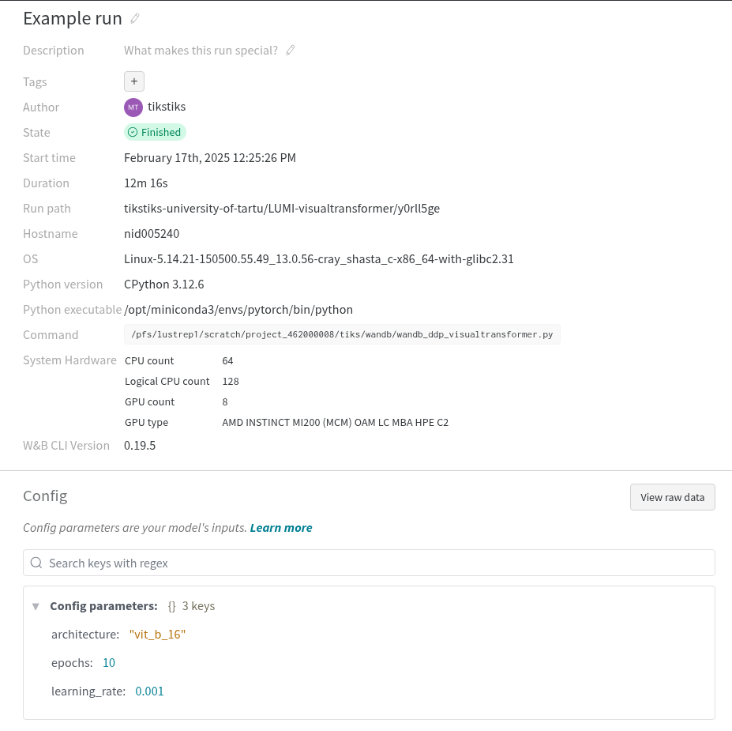
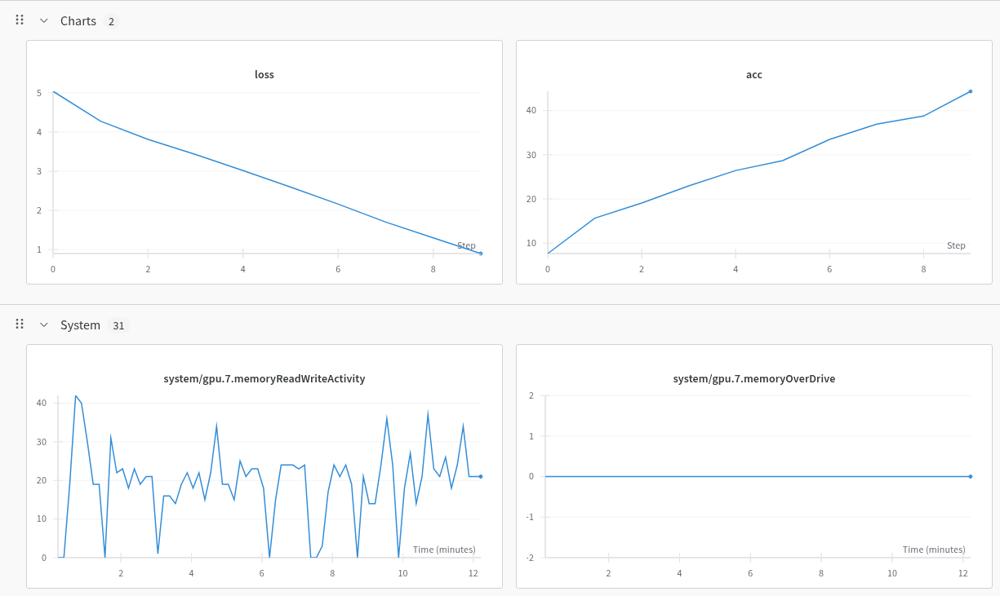
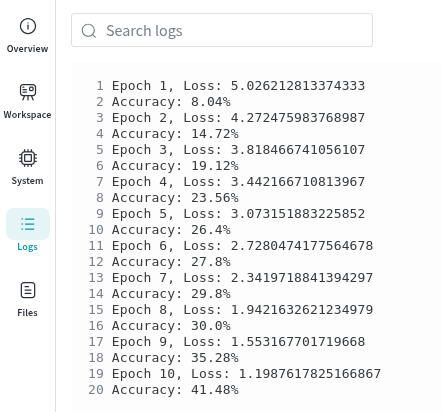

# Wandb visualization

> [!NOTE]  
> If you wish to run the included examples on LUMI, have a look at the [quickstart](../quickstart/README.md) chapter for instructions on how to set up the required environment.

[Weights & Biases](https://docs.wandb.ai/guides) is an AI developer platform consisting of three major components: [Models](https://docs.wandb.ai/guides/models/), [Weave](https://wandb.github.io/weave/) and [Core](https://docs.wandb.ai/guides/core/). These components provide features such as tracking your runs, models and datasets, visualizing data and hyperparameter sweeps.


## Initializing Wandb

[W&B QuickStart](https://docs.wandb.ai/quickstart/) Consists of 2 simple steps: registering an account and authenticating with the API key on LUMI.

Registering and getting the API key can be done [here](https://wandb.ai/authorize). After having received the API key, the following commands will authenticate your account on LUMI.

```bash
export WANDB_API_KEY=<your_api_key>
pip install wandb
wandb login
```

Your login details will be saved in `~/.netrc`, which can be deleted to effectively log out.

## Collecting Logs & Tracking Parameters

[Weights & Biases Models Experiments](https://docs.wandb.ai/guides/track/) provide a simple way to track machine learning experiments with a few lines of code. You can then review the results in an interactive dashboard/

Initialize a W&B Run object in your Python script or notebook with wandb.init() and pass a dictionary to the config parameter with key-value pairs of hyperparameter names and values. Since during distributed runs we use  multiple processes, we set one of the processes to be responsible for collecting the logs. This can be done via using the `rank` environment variable assigned to every process created by Slurm. We can use this variable to assign the task of logging to the first process - rank 0:
```bash
import wandb
...
rank = int(os.environ["RANK"])
if rank == 0:
    wandb.init(
        # set the wandb project where this run will be logged
        project="LUMI-visualtransformer",
        name="Example run",

        # track hyperparameters and run metadata
        config={
            "learning_rate": 0.001,
            "architecture": "vit_b_16",
            "epochs": 10,
            }
    )

```

To log our training accuracy and loss, we can add the logging function to the end of our training loop.

```bash
    for epoch in range(epochs):
    ...
        if rank == 0:
            print(f"Accuracy: {100 * correct / total}%")
            wandb.log({"acc": 100 * correct / total, "loss": running_loss/len(train_loader)})
```

In addition to this wandb automatically logs system metrics every 10 seconds. W&B extracts metrics from the output of the rocm-smi tool supplied by AMD(`rocm-smi -a --json`), such as GPU utilization, power usage, and allocated memory. It also tracks network traffic, CPU and disk utilization.

If everything is correct, wandb will produce some information about the tracking and where to find the visualization.
```bash
wandb: Currently logged in as: <user> (<organization>) to https://api.wandb.ai. Use `wandb login --relogin` to force relogin
wandb: Using wandb-core as the SDK backend.  Please refer to https://wandb.me/wandb-core for more information.
wandb: - Waiting for wandb.init()...^Mwandb: \ Waiting for wandb.init()...^Mwandb: Tracking run with wandb version 0.19.5
wandb: Run data is saved locally in /pfs/lustrep1/scratch/project_xxxxxxxxx/dir/wandb/wandb/run-20250217_125546-0ztzgx0x
wandb: Run `wandb offline` to turn off syncing.
wandb: Syncing run Example run
wandb: ⭐️ View project at https://wandb.ai/<organization>/LUMI-visualtransformer
wandb: 🚀 View run at https://wandb.ai/<organization>/LUMI-visualtransformer/runs/0ztzgx0x

```


## Wandb Web Interface

Navigate to https://wandb.ai/home to inspect the logs. `LUMI-visualtransformer` (the project name we provided in the initialization) should be visible under `Your recent projects`. After selecting the project, you should be able to see the run that was just executed, which we named `Example run`. 

Under `Overview` you will be able to find general statistics of the run, such as the parameters we specified in the configuration, GPU count, Python version, run duration and so on.



Under `Workspace` the logs we collected (loss and accuracy in addition to system) will be displayed.



Finally, the `Logs` tab will show the output of the run after the initialization of Wandb. 



### Table of contents

- [Home](../README.md)
- [QuickStart](../quickstart/README.md)
- [Setting up your own environment](../setting-up-environment/README.md)
- [File formats for training data](../file-formats/README.md) 
- [Data Storage Options](../data-storage/README.md)
- [Multi-GPU and Multi-Node Training](../multi-gpu-and-node/README.md)
- [Monitoring and Profiling jobs](../monitoring-and-profiling/README.md)
- [TensorBoard visualization](../TensorBoard-visualization/README.md)
- [MLflow visualization](../MLflow-visualization/README.md)
